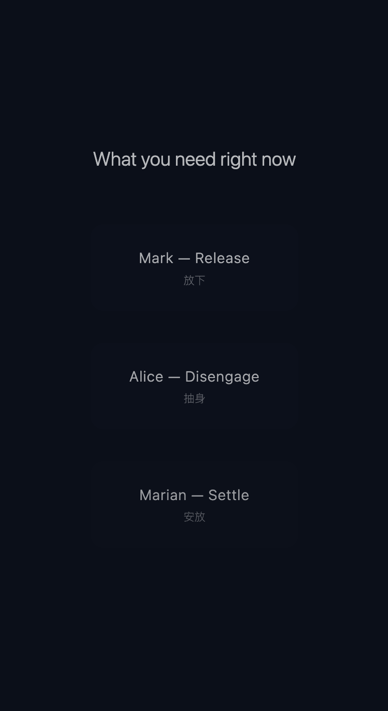

# Case Study

## Summary

Good Night is a bedtime voice UX prototype that explores designed withdrawal: a voice agent that helps the user leave the interaction instead of extending it.

The project began with a simple observation: many people stay on their phones in bed even when they are already tired. Often, this is not because they want more content. They are not ready to let go of the day.

The project asks how voice interaction can become lower-friction, lower-stimulation, and less demanding as the user approaches sleep. It shifted from designing a soothing AI voice toward designing withdrawal: how the system slows down, reduces presence, and gives the user a way to stop.

## Project Snapshot

| Area | Detail |
| --- | --- |
| Role | Product concept, voice UX, sound interaction design |
| Medium | Voice UI, TTS, sound design, interaction timing |
| Tools | Doubao TTS 2.0, ElevenLabs, Reaper, Figma |
| Prototype | Figma prototype and voice persona demos |
| Status | Concept prototype with exploratory feedback |
| Focus | Designed withdrawal, persona-based comfort, low-stimulation interaction |

## Problem

Most voice systems are designed around response, efficiency, and engagement. They answer quickly, keep the conversation moving, and assume that more interaction is valuable.

The last 30 minutes before sleep require a different logic. In this context, the user may not need advice, explanation, or even comfort. They may need a way to release attention, reduce stimulation, and move out of the active state of the day.

Many bedtime products add more content: meditations, prompts, reminders, tracking, coaching, or long audio sessions. Good Night explores the opposite direction.

The core problem is not how to make an AI say more. It is how to make an AI voice reduce itself at the right time.

## Design Question

How might AI voice support the transition from wakefulness to sleep without increasing engagement?

This question gradually shifted the project from:

```text
What should the AI say?
```

to:

```text
When is the AI no longer needed to speak?
```

## Product Hypothesis

A bedtime voice agent can support disengagement if it:

- reduces language over time,
- avoids analysis and coaching,
- treats silence as valid,
- uses one small action at a time,
- exits warmly without reopening the conversation.

## Interaction Arc

```text
Arrival -> Unloading -> Slowing -> Fading -> Exit
```

The arc is intentionally short. It is designed for a tired user who may not want a deep conversation, a therapy-like exchange, or a task list.

| Phase | User state | System behavior | Voice behavior | UI behavior |
| --- | --- | --- | --- | --- |
| Arrival | Still awake, holding the day | Opens gently | Soft, low-pressure | Simple entry |
| Unloading | Thoughts still active | Allows light release | Short responses | Minimal prompts |
| Slowing | Attention reduces | Reduces interaction | Longer pauses | Dimmer interface |
| Fading | User stops responding | Withdraws presence | Sparse language | Visual elements fade |
| Exit | Toward sleep | Ends interaction | Silence becomes system | Screen settles or closes |

## UI Direction

The interface is designed to ask for less over time. It begins with a quiet persona selection screen and a simple Good Night entry point. During the session, brightness reduces, subtitles become optional, visual elements fade, and interaction gradually disappears.




The interface follows the same principle as the voice: it gradually withdraws from attention.

## Process And Iteration

The project evolved through three persona directions:

- Mark v1 to v3: from conversational tone to slower pacing, lower engagement, and designed withdrawal.
- Alice v1 to v2: from calm voice to reduced language and broken semantic continuity.
- Marian v1 to v2: from a more character-like elderly tone to minimal presence and near-imperceptible voice.

Exploring the language of each persona became a way of asking what state the user was actually in. The work moved away from better phrasing alone and toward lower stimulation, fewer prompts, and a clearer exit.

## Prototype

The prototype includes:

- three persona voice demos: Mark, Alice, and Marian,
- a public English ElevenLabs Conversational Agent,
- an existing GitHub Pages case route,
- a prompt system designed around withdrawal rather than engagement.

## Design Decisions

1. Support release, not engagement.
   Most voice systems are optimized to respond. In this case, the goal is to support the user in gradually leaving the interaction.

2. Treat time as a primary design material.
   Pacing, pause, duration, and reduced activity over time shape the experience as a temporal process, not a sequence of responses.

3. Use voice personas as interaction strategies.
   Mark, Alice, and Marian are not characters for roleplay. They are different ways of guiding the user out of interaction: release, disengage, and settle.

4. Separate timing control from TTS generation.
   Current TTS systems provide limited control over breath and pause, so speech was generated in smaller segments and manually structured in Reaper.

5. Reduce semantic density.
   The more the voice tries to communicate, the harder it can be for the listener to let go.

6. Let the system disappear.
   The final stage is not a conclusion, but a disappearance. Voice, UI, and prompts gradually withdraw.

## Outcome

The project resulted in:

- a time-based voice interaction model for bedtime disengagement,
- a voice persona system with three interaction strategies,
- a sound and timing design approach using phrase-level editing and spatial control,
- a Figma prototype demonstrating fading interaction and UI withdrawal,
- audio demos exploring presence, pause, and silence.

The strongest design insight is that Good Night should become less active over time. The agent should not reward continued interaction with more content. It should make stopping feel acceptable.

Falling asleep is not about receiving more input. It is about gradually releasing attention, thought, and interaction. The strongest contribution of this project is not simply a soothing AI voice, but the design of withdrawal: how interaction fades, how the system gives up control, and how the user is allowed to stop.

## Next Evaluation Questions

- Which persona feels calm without feeling too intimate?
- Which voice remains clear at low intensity?
- At what point should the system stop asking questions?
- Does the final closure make the user more likely to put the phone down?
- Which phrases feel supportive, and which feel too therapeutic or sentimental?
