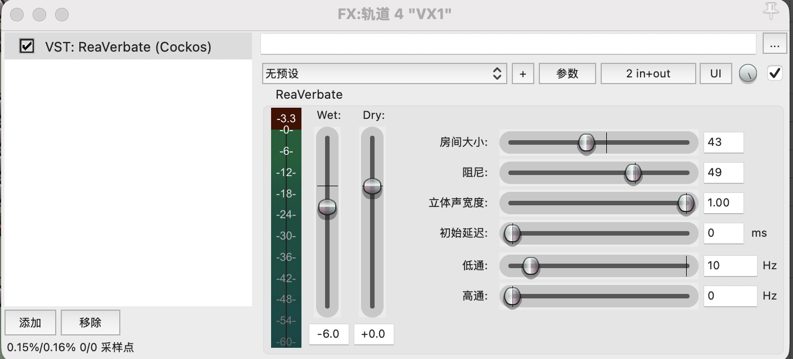

# Sound And Timing Design

Good Night treats timing as part of the interaction model. The experience should become quieter, shorter, and less demanding over time.

Sound was not treated as decoration. It became the primary material for interaction design: pacing, breath, pause, spatial distance, and the degree of voice presence all shape whether the listener feels invited to continue or allowed to stop.

## Core Timing Rules

- Speak slowly and softly.
- Ask at most one simple question at a time.
- Ask fewer questions as the session continues.
- If the user keeps talking, respond with less content than the user gave.
- Do not stack multiple actions in one response.
- Treat silence as valid.
- Move toward closure immediately when the user says they are tired, sleepy, done, or says good night.

## Production Method

The voice system was developed through multiple iterations of tone, pacing, and presence.

- Mark and Alice were synthesized with Doubao TTS 2.0.
- Marian was developed with ElevenLabs instant voice cloning and Eleven v3.
- Ambience, reverb, EQ, silence, and spatial distance were shaped in Reaper.
- Phrase-level speech fragments were used so breath, pause, and spacing could be controlled outside the TTS model.

Current TTS systems still offer limited control over breath and pause. Breath is often treated as decoration, and pauses are often generated through semantic prediction rather than designed as precise temporal structures. To address this, timing control was separated from TTS generation: the voice was generated in smaller phrase-level segments, then manually structured in Reaper.

## Language Shape

Good Night should use short, low-stimulation sentences.

Useful examples:

```text
I am here.
We can slow down now.
That can wait.
You can put the phone down soon.
Nothing more is needed right now.
```

Avoid:

- therapy language,
- coaching language,
- motivational language,
- long explanations,
- new ideas that invite more conversation,
- dramatic or overly intimate phrasing,
- bracketed performance tags.

## Fade Logic

The voice should reduce itself over time:

```text
more presence -> shorter responses -> fewer prompts -> quiet closure
```

The fade is not only an audio effect. It is a behavior pattern: the agent becomes less active so the user can leave.

## Spatial Direction

Each persona uses a slightly different spatial strategy:



| Persona | Spatial behavior | Design intent |
| --- | --- | --- |
| Mark / Release | Space fades | Helps emotional residue soften without extending the conversation. |
| Alice / Disengage | Space dissolves | Reduces participation and lowers semantic pressure. |
| Marian / Settle | Space stabilizes | Creates a quiet, steady closing presence. |

## A/B Comparison

The raw TTS versions had continuous speech flow, model-generated pauses, and limited breathing structure. Emotion was interpreted by the model, but not fully controllable. The designed versions used phrase-level generation, manually controlled pauses, separate breath layers, and spatial processing.

The main learning was not that the voice needed to become more expressive. It needed to create less pressure. The more the voice tries to communicate, the harder it can be for the listener to let go.

Audio references:

- Sixu a Mark v2: [Raw](../assets/audio/ab/sixu-a-mark-v2-raw.mp3) / [Designed long-pause](../assets/audio/ab/sixu-a-mark-v2-designed-long-pause.mp3)
- Zhaogu buzuo: [Raw](../assets/audio/ab/zhaogu-buzuo-mark-v1-raw.mp3) / [Designed v2](../assets/audio/ab/zhaogu-buzuo-mark-v2-designed-v2.mp3)

Evaluation focus: how timing structure changes perceived listening, conversational pacing, and interaction presence in AI-generated voice.

| Dimension | Version A | Version B |
| --- | ---: | ---: |
| Naturalness | 2 | 4 |
| Pause Quality | 1 | 5 |
| Emotional Stability | 3 | 4 |
| Presence | 1 | 5 |
| Listening Comfort | 2 | 5 |
| Conversational Feeling | 2 | 4 |

## Acoustic Metrics

The Notion source includes a small Librosa analysis using `--syllables 13 --min-pause 100 --top-db 30`. The `speech_rate` field uses a fixed 13-syllable assumption, so it should be treated as directional rather than final phonetic measurement.

| Case | Version | Duration | Voice duration | Silence | Silence ratio | Pause count | Avg pause |
| --- | --- | ---: | ---: | ---: | ---: | ---: | ---: |
| Sixu a Mark v1 | Raw | 4.62s | 3.55s | 1.07s | 23.16% | 4 | 244.5ms |
| Sixu a Mark v1 | Designed v2 | 6.92s | 3.54s | 3.38s | 48.85% | 5 | 667.0ms |
| Sixu a Mark v2 | Raw | 4.75s | 2.19s | 2.56s | 53.85% | 4 | 631.3ms |
| Sixu a Mark v2 | Designed long-pause | 7.03s | 2.22s | 4.81s | 68.44% | 4 | 1193.7ms |
| Zhaogu buzuo | Raw | 5.77s | 3.34s | 2.43s | 42.08% | 3 | 805.9ms |
| Zhaogu buzuo | Designed v2 | 9.33s | 4.04s | 5.29s | 56.68% | 5 | 1057.1ms |

The designed versions increase total duration and silence ratio while keeping speech content largely comparable. This supports the core claim that timing edits can change perceived presence without relying on more expressive wording.
