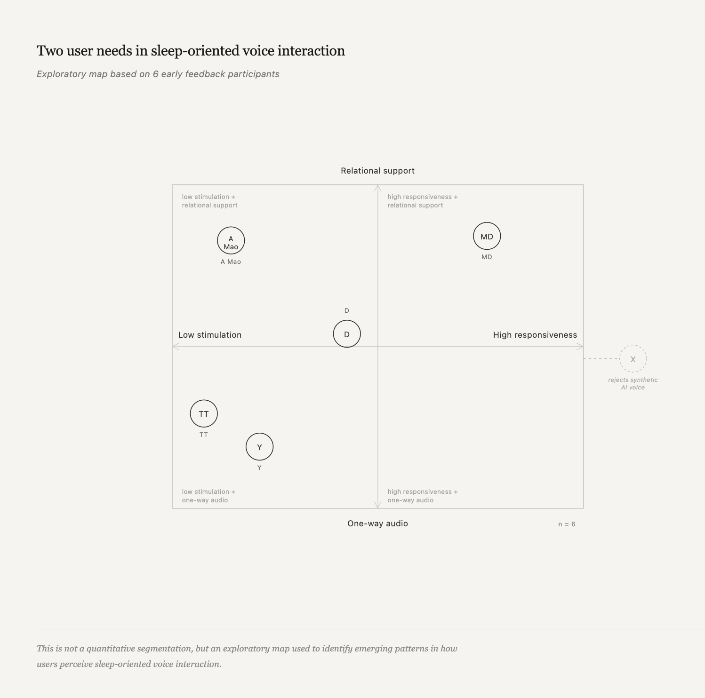

# User Feedback

The prototype was tested through informal sessions with a small group of users, focusing on how voice, timing, and interaction affected the transition into rest. The notes below are exploratory pattern recognition, not validated segmentation.

## Feedback Summary

| Participant | Profile | Voice preference | Key insight | Design implication |
| --- | --- | --- | --- | --- |
| DY | Light, low-stimulation sleeper | Mark / Release | The fading experience felt relaxing and a little ASMR-like. | Strengthen the Exit phase. |
| MD | Severe insomnia, AI-dependent user | Mark | Security came from the system being continuously available and interactive. | One-way voice may be insufficient for high-need users. |
| TT | Ambivalent user | Mark | Speaking can increase cognitive load: when the user talks, the mind may keep working. | Timed shutdown and one-way content may be more effective. |
| CAT | Exit-signal sensitive user | Marian / Settle | "You can leave it here" worked as a strong disengagement cue. | Explicit exit cues are effective. |
| AY | White-noise and scenario-oriented user | None | The voice felt stiff or visibly AI. | Human-like TTS remains a core challenge. |
| CX | Highly sensitive, AI-tone-averse user | Marian | AI voice tone itself was hard to accept; real human recording may work better. | Voice authenticity is a key barrier. |

## Key Findings

1. Sleep support is not one need.
   The strongest divergence was between low-stimulation passive companionship and interactive emotional security. These may require different product architectures.

2. The withdrawal phase is the strongest direction.
   Fading sound, dimming UI, and explicit exit cues were consistently valued across participants.

3. AI tone remains the primary barrier.
   Even with phrase-level editing, synthetic voice quality was flagged by multiple users. Voice authenticity is an open design challenge.

## Prototype Learning

The most important shift was moving from:

```text
making the voice better
```

to:

```text
reducing the need for voice
```

This reinforced the idea that, in this context, interaction design is not about maintaining engagement. It is about supporting disengagement.

## Suggested Feedback Axes

For each persona demo, collect:

- comfort,
- clarity,
- perceived intimacy,
- perceived safety,
- pacing,
- likelihood of putting the phone down,
- whether the voice invites continuation or closure.

## 2x2 Map



Useful axes for future synthesis:

```text
            clear
              ^
              |
heavy <-------+-------> light
              |
              v
           unclear
```

Another useful map:

```text
         helps me leave
              ^
              |
cold <--------+--------> too intimate
              |
              v
       keeps me engaged
```

This map should be used to generate design directions, not to define user segments. It suggests that sleep-oriented voice interaction is not a single user need: some participants preferred calm, low-stimulation audio that helps them disengage, while others expected a more responsive and relational system that could help them feel understood before sleep. One participant sits outside the matrix because the primary issue was not preference inside the design space, but rejection of generated AI voice itself.

## Open Questions

- Which persona should be the default?
- Should the agent ask an opening question, or begin with permission to do less?
- How quickly should the voice move from unloading to fading?
- What should happen after a long silence?
- Which forms of memory feel helpful, and which feel intrusive?
